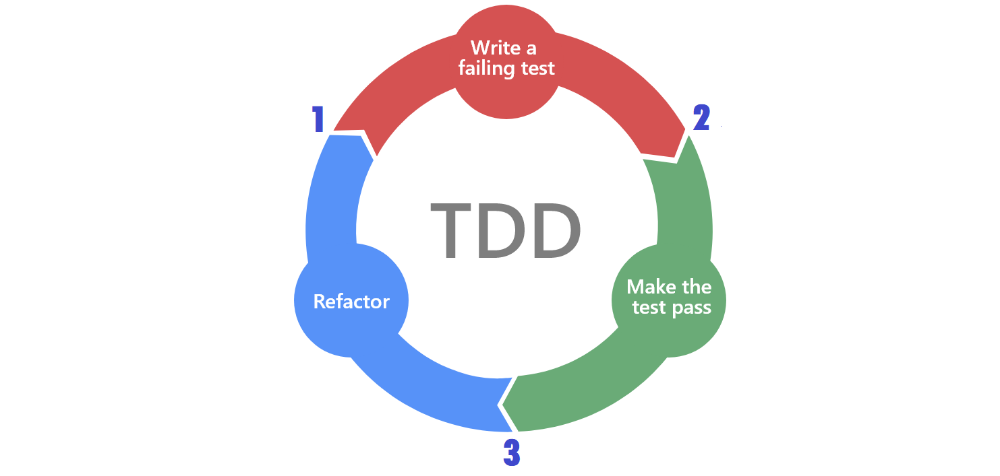

# Testing Java
### Table of contents
- [General info](#general-info)
- [Technologies](#technologies)
- [Setup](#setup)
- [Things learned](#things-learned)
>- Importance of tests.
>- How tests should be named.
>- Types of tests.
>- How to use mockito.
>- Differences between manual and automatic tests.
>- TDD cycle.
- Commands


------------

### General info
This repository contains files and summary of things learned in the Platzi's Testing Java course. The testing java course taught how to create a test class and name and perform tests in that class. It also taught how to simulate classes so we can force certain behaviors or results and make more comprehensive tests. The files created within different packages contain code that should be tested to ensure the code works fine to solve different probles. The paymets package has code for payments processing. The util package contains DateUtil class, used to determine if a year is leap or not, and the StringUtil class, used to repeat a given string a certain number of times. The player package contains files used to throw a dice. And fnially the movies package contains files to select, filter and add movies to a simulated database. Each scenario has its own testing class within the Tests directory.

------------

### Technologies
- OpenJDK8 (requieres installation)
- IntelliJ IDEA (requieres installation)

Requiered dependencies. Used within Intellij IDEA.
- JUnit
- Mockito
- H2databases
- Spring

------------

### Setup

###### IntelliJ IDEA 
- Go to https://www.jetbrains.com/idea/download/ and download the Community version

###### OpenJDK
- Go to https://adoptopenjdk.net/ and download the following version:
    - OpenJDK 8
   
Within Intellij IDEA

###### Dependencies:
- Mockito, H2DataBases, Spring. Copy the next code and insert it into the pom.xml file in the dependencies part of the code.
```java
<dependency>
            <groupId>junit</groupId>
            <artifactId>junit</artifactId>
            <version>4.12</version>
            <scope>test</scope>
</dependency>

<dependency>
            <groupId>org.mockito</groupId>
            <artifactId>mockito-core</artifactId>
            <version>2.23.4</version>
            <scope>test</scope>
</dependency>

<dependency>
            <groupId>com.h2database</groupId>
            <artifactId>h2</artifactId>
            <version>1.4.192</version>
</dependency>

<dependency>
            <groupId>org.springframework</groupId>
            <artifactId>spring-jdbc</artifactId>
            <version>5.1.3.RELEASE</version>
</dependency>
```

------------
### Things learned
- Importance of tests. The testing is important since it discovers defects/bugs before the delivery to the client, which guarantees the quality of the software.

- How to create a test. Using Junit in Intellij IDEA we only need to press alt + enter and create test.

- How tests should be named. Tests name must be explicit about their purpose and named this way: this_is_a_name_example or repeat_four_times_the_string.

- How to write and run a test.

- How tests should be planned and executed.

- Tests workflow.

- How to obtain a simulated and specific result of a class using Mockito. Here is an example where we are emulating a dice result:
```java
    @Test
    public void player_looses_when_dice_is_too_low(){
        Dice dice = Mockito.mock(Dice.class);
        Mockito.when(dice.roll()).thenReturn(2);

        Player player = new Player(dice, 3);
        assertEquals(false, player.play());
```

- Connection to simulated databases using H2databases.

- Organization of apps in layers. (interface, business, data, databases).

- Test types (Unitary, Integration, Functional, StartToEnd).
>- Unitary test: A piece of code written by a developer that executes a specific functionality in the code to be tested and asserts a certain behavior or state. The percentage of code which is tested by unit tests is typically called test coverage. A unit test targets a small unit of code, e.g., a method or a class. 
>- Integration test: Aims to test the behavior of a component or the integration between a set of components. The term functional test is sometimes used as synonym for integration test. Integration tests check that the whole system works as intended, therefore they are reducing the need for intensive manual tests.
>- StartToEnd: Refers to a software testing method that involves testing an application’s workflow from beginning to end. This method basically aims to replicate real user scenarios so that the system can be validated for integration and data integrity.

- Differences between manual and automatic tests. Manual testing is very hands-on. It requires analysts and QA engineers to be highly involved in everything from test case creation to actual test execution. Automation testing involves testers writing test scripts that automate test execution. 
>- Manual Testing is done manually by QA analyst (Human) whereas Automation Testing is done with the use of script, code and automation tools (computer) by a tester.
>- Manual Testing process is less accurate because of the possibilities of human errors whereas the Automation process is more reliable because it is code and script based.
>- Manual Testing is a time-consuming process whereas Automation Testing is very fast.
>- Manual Testing allows random Testing whereas Automation Testing doesn’t allow random Testing.

- TDD cycle. Test-driven development (TDD) is a software development process relying on software requirements being converted to test cases before software is fully developed, and tracking all software development by repeatedly testing the software against all test cases. This is opposed to software being developed first and test cases created later.


------------
### Commands
|  Command | Function  |
| ------------ | ------------ |
| @Test | Creates a test. |
| @Before | Executes code before a test begins. |
| @After | Executes code every time a test ends.|
| assertEquals() | Creates a test. |
| Mockito.mock(Class class) | Simulates a class instance. |
| Mockito.when() | Simulates a result of the simulated class instance. |
| CoreMatchers.is() | Command from CoreMatchers library utilized to compare 2 values and return a boolen value. |


